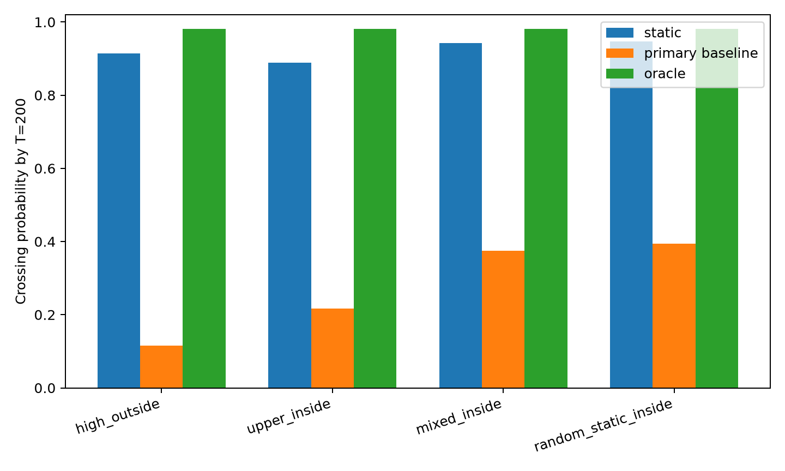
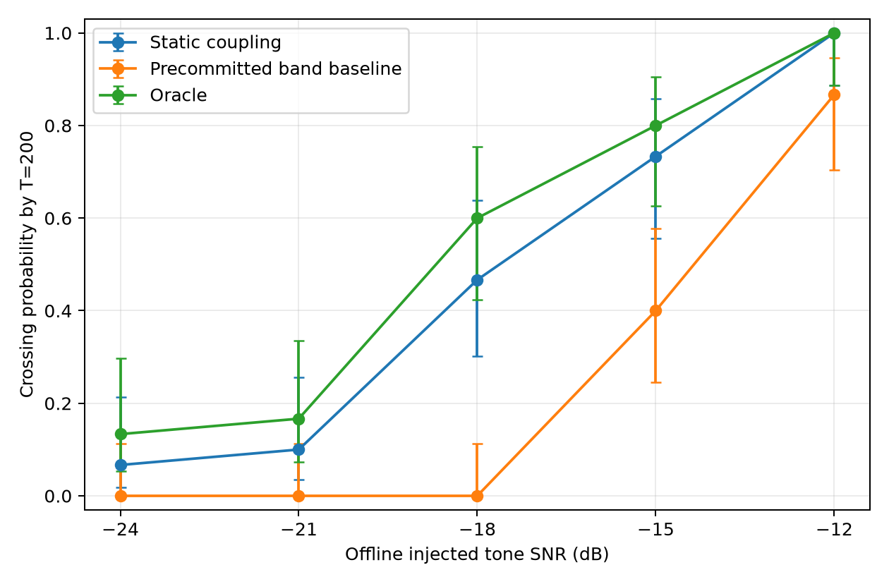

# LIMEN-RF

> **Anytime-valid predictive-rank detection with a statically contaminated fixed reference set**

[](https://github.com/topassky3/limen-rf/actions/workflows/ci.yml)

**LIMEN-RF** is a reproducible research project for sequential distribution-shift detection when a finite reference bank may already contain a small number of **static, exogenous contaminated observations** and that same bank is repeatedly reused online.

**Author:** Juan Felipe Orozco Cortés  
**Manuscript:** *Anytime-Valid Predictive-Rank Detection with a Statically Contaminated Reference Set*  
**Status:** theory frozen · publication Monte Carlo complete · geometry stress test complete · RTL-SDR V1/V2 characterization complete · manuscript prepared for peer review

---

## At a glance

| Item | LIMEN-RF |
|---|---|
| Statistical setting | Fixed finite reference bank with unknown persistent contamination identities |
| Online task | Sequential distribution-shift detection |
| Core mechanism | Candidate-wise clean-rank reconstruction + predictive-rank betting |
| Validity statement | Finite-sample anytime threshold-crossing control under the stated iid continuous, static/exogenous model |
| Primary simulation | 5,000 replications, (K=32), (m=2), (T=200) |
| Stress test | Four pre-specified contamination geometries |
| Hardware evidence | Semi-synthetic RTL-SDR V1/V2 engineering characterization |
| Reproducibility | Frozen runbooks, manifests, hashes, source code, tests and CI |

---

## The problem

A sequential detector often compares new observations against a finite reference bank. If a few reference cells are already contaminated and their identities are unknown, repeatedly reusing that bank can distort the evidence accumulated online.

LIMEN-RF treats those contamination identities as **persistent but unknown**.

For every candidate set of contaminated sorted positions, the method reconstructs the rank sequence that would remain after deleting that candidate.

The reconstruction is

```math
R_t^{(C)}
=
Q_t
-
\#\{c \in C : c \le Q_t\}.
```

where:

- $Q_t$ is the rank/count of the new observation against the full observed reference bank;
- $C$ is one candidate set of contaminated sorted positions;
- $R_t^{(C)}$ is the corresponding reconstructed clean-reference rank.

For the true candidate $C^\star$, the reconstruction is exactly the rank against the latent clean reference sample.

The robust evidence used for threshold crossing is

```math
\underline{E}_t
=
\min_C E_t^{(C)}.
```

Therefore, pathwise,

```math
\underline{E}_t
\le
E_t^{(C^\star)}.
```

The true-candidate wealth is the clean predictive-rank martingale. This pathwise domination is what yields the anytime-valid crossing guarantee.

> **Important:** $\underline{E}_t$ itself is **not claimed to be a martingale, supermartingale, or e-process**.

---

## Main contributions

1. **Pathwise rank reconstruction** under unknown persistent contamination identities.
2. **Anytime-valid threshold-crossing control** through domination by the true candidate.
3. **Unknown-contamination-count extension** when only an upper bound is available.
4. **Contiguous-partition representation** of candidate deletions.
5. **Exact dynamic program** for a fixed categorical bettor with:
   - time complexity: $O(Km^2)$
   - memory complexity: $O(Km)$
6. **Frozen publication-scale experiments** plus a contamination-geometry stress test.
7. **RTL-SDR engineering characterization** using real receiver/background IQ with controlled post-ADC injection.

---

## Publication-scale result

Primary frozen simulation point:

- $K=32$ observed reference values
- $m=2$ static contaminants
- monitoring horizon $T=200$
- future shift $X_t \sim \mathrm{Beta}(4,1)$
- 5,000 Monte Carlo replications

| Method | Crossing probability by T = 200 |
|---|---:|
| **Static candidate coupling** | **0.9144** |
| Designated confidence-band comparator | 0.1152 |
| Oracle | 0.9810 |

The pre-specified V1b stress test changed only the contamination geometry while keeping the detector frozen.

At the same primary point, static crossing probabilities across the three non-control geometries were:

| Geometry | Static | Designated comparator | Oracle |
|---|---:|---:|---:|
| Upper in-support | 0.8894 | 0.2162 | 0.9810 |
| Mixed in-support | 0.9422 | 0.3742 | 0.9810 |
| Random static in-support | 0.9468 | 0.3948 | 0.9810 |

### Geometry stress test



The figure is generated from the frozen V1b artifacts stored under `results/publication_v1b_geometry/`.

---

## RTL-SDR characterization

A second evidence layer uses fresh RTL-SDR captures with controlled post-ADC tone injection.

Selected V2 results:

| Injected SNR | Static | Comparator | Oracle |
|---|---:|---:|---:|
| -24 dB | 2/30 | 0/30 | 4/30 |
| -21 dB | 3/30 | 0/30 | 5/30 |
| -18 dB | **14/30** | **0/30** | 18/30 |
| -15 dB | **22/30** | **12/30** | 24/30 |
| -12 dB | **30/30** | **26/30** | 30/30 |



These experiments are **engineering sensitivity characterizations**, not a hardware validation of the iid type-I theorem. The physical score streams exhibit serial dependence, and the controlled injection is performed after the ADC.

---

## Scientific scope

The theorem applies when:

- observations are scalar;
- the clean null distribution is unknown and continuous;
- the observed reference bank is fixed;
- contaminated identities are static/exogenous;
- deleting the true contaminated cells leaves an iid clean reference sample;
- future null observations are iid from the same clean distribution.

The paper does **not** claim validity for:

- value-adaptive replacement after inspecting the realized clean bank;
- contamination identities that change during monitoring;
- arbitrary temporal dependence;
- arbitrary distribution drift;
- minimax optimality;
- universal superiority over conformal, CCTM, or other e-process methods;
- hardware type-I control from the RTL-SDR experiments.

---

## Reproduce the software

Requirements:

- Python 3.13 or 3.14
- [uv](https://docs.astral.sh/uv/)

```bash
git clone https://github.com/topassky3/limen-rf.git
cd limen-rf

uv sync --locked

uv run ruff check .
uv run pytest
uv run python -m limen_rf.smoke
```

The same software checks run automatically in GitHub Actions.

For publication experiment reproduction, artifact hashes, and frozen run commands, use:

**[REPRODUCIBILITY.md](REPRODUCIBILITY.md)**

---

## Repository guide

| Path | Purpose |
|---|---|
| `src/limen_rf/` | Reusable implementation |
| `tests/` | Unit and regression tests |
| `experiments/` | Frozen Monte Carlo and SDR experiment drivers |
| `configs/` | Experiment configuration |
| `docs/math/` | Theorems, method freeze, proof/audit material |
| `docs/experiments/` | Pre-outcome protocols, runbooks and frozen result notes |
| `docs/literature/` | Prior-art and novelty audits |
| `results/publication_v1/` | Publication Monte Carlo summaries and figures |
| `results/publication_v1b_geometry/` | Geometry stress-test artifacts and SHA-256 hashes |
| `results/sdr_publication_v2/` | Frozen SDR V2 derived outputs and figures |
| `paper/sections/` | Shared scientific manuscript source |
| `paper/redin/` | REDIN identified and double-blind manuscript wrappers |

---

## Scientific freeze and audit trail

The detector was frozen before the publication-scale outcomes were used for manuscript conclusions.

Key documents:

- **Method freeze:** [docs/math/method_freeze_post_killtest13.md](docs/math/method_freeze_post_killtest13.md)
- **Formal audit:** [docs/math/formal_audit_external_review_v0_1.md](docs/math/formal_audit_external_review_v0_1.md)
- **V1 protocol:** [docs/experiments/publication_validation_v1_runbook.md](docs/experiments/publication_validation_v1_runbook.md)
- **V1b protocol:** [docs/experiments/publication_validation_v1b_geometry_runbook.md](docs/experiments/publication_validation_v1b_geometry_runbook.md)
- **V1b frozen result:** [docs/experiments/publication_validation_v1b_geometry_result.md](docs/experiments/publication_validation_v1b_geometry_result.md)
- **SDR V2 protocol:** [docs/experiments/sdr_publication_v2_runbook.md](docs/experiments/sdr_publication_v2_runbook.md)
- **SDR V2 frozen result:** [docs/experiments/sdr_publication_v2_result.md](docs/experiments/sdr_publication_v2_result.md)
- **Final novelty sweep:** [docs/literature/final_novelty_sweep_static_contaminated_reference.md](docs/literature/final_novelty_sweep_static_contaminated_reference.md)

Some historical internal files use the word *preregistered*. The manuscript uses the more precise wording **pre-specified and repository-frozen before outcomes were viewed**, because the protocol was frozen in repository history rather than registered in an external preregistration registry.

---

## Manuscript

The journal manuscript source is under `paper/`.

REDIN wrappers:

- `paper/redin/article.tex` — identified author version
- `paper/redin/article_identified.tex` — synchronized identified alias
- `paper/redin/article_blind.tex` — double-blind reviewer version

Compilation instructions are in:

**[paper/redin/README.md](paper/redin/README.md)**

---

## Data availability

This repository versions:

- source code;
- tests;
- frozen experimental protocols;
- simulation outputs;
- manifests;
- SHA-256 hashes;
- derived RTL-SDR result tables;
- publication figures.

Raw receiver IQ captures under `data/` are intentionally not versioned in Git.

Consequently:

- the simulation study is directly reproducible from the repository;
- the frozen SDR derived artifacts are auditable and hash-verifiable;
- detector-level replay of the physical acquisition requires the original/local IQ captures or a new acquisition under the documented receiver settings.

---

## Citation

Citation metadata is provided in **[CITATION.cff](CITATION.cff)**.

Once the associated article receives a DOI, the citation metadata should be updated to point first to the published article.

---

## License

No open-source license has been selected yet.

Making a repository public does not by itself grant permission to reuse, modify, or redistribute its contents. A software/data license should be chosen explicitly if third-party reuse is intended.
